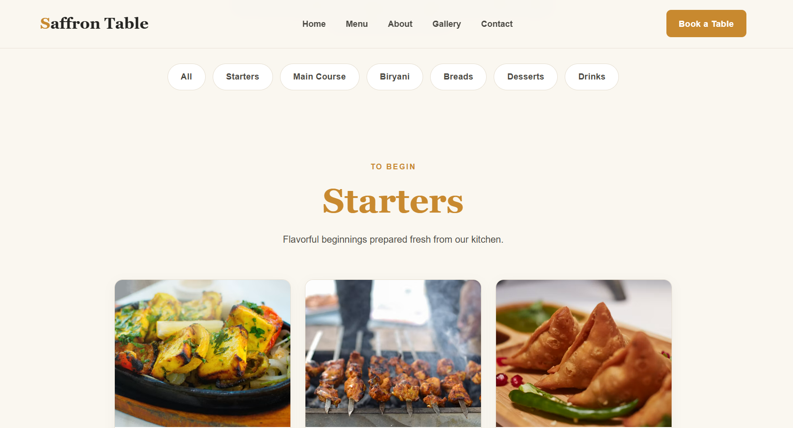
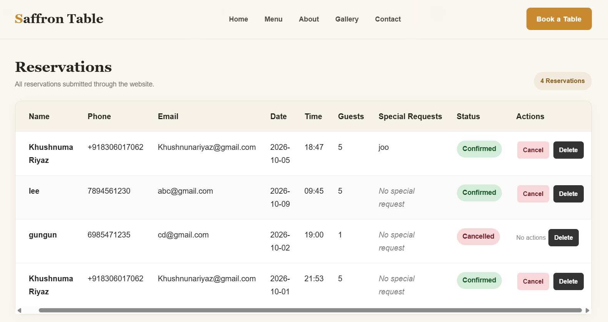

# 🍽️ Saffron Table

A modern Indian restaurant website with an integrated table reservation system, customer contact management, and admin dashboard.

Saffron Table was built as a full-stack web development project using Flask, SQLite, HTML, CSS, and JavaScript.

---

## ✨ Features

### Customer Website

- Responsive restaurant website
- Modern Indian restaurant design
- Home page with featured dishes
- Menu with category filtering
- About restaurant page
- Image gallery with lightbox
- Table reservation form
- Reservation confirmation page
- Contact form
- Mobile-friendly navigation

### Reservation System

Customers can submit:

- Name
- Phone number
- Email
- Reservation date
- Reservation time
- Number of guests
- Special requests

Reservations are stored in a SQLite database.

### Admin Dashboard

The admin panel provides:

- Secure admin login
- Reservation statistics
- View all reservations
- Confirm reservations
- Cancel reservations
- Delete reservations
- View customer messages
- Mark messages as read
- Delete messages
- Message statistics
- Logout/session management

---

## 🛠️ Tech Stack

### Frontend

- HTML5
- CSS3
- JavaScript

### Backend

- Python
- Flask

### Database

- SQLite

### Other

- Jinja2 Templates
- python-dotenv

---

---

## 📸 Screenshots

### 🏠 Home Page


### 🍽️ Menu



### 📅 Reservation


### 💬 Contact


### 🔐 Admin Dashboard




## 📁 Project Structure

```text
saffron_table/
│
├── static/
│   ├── css/
│   │   └── style.css
│   │
│   ├── images/
│   │
│   └── js/
│       └── script.js
│
├── templates/
│   ├── about.html
│   ├── admin_login.html
│   ├── admin.html
│   ├── base.html
│   ├── confirmation.html
│   ├── contact.html
│   ├── gallery.html
│   ├── index.html
│   ├── menu.html
│   └── reservation.html
│
├── app.py
├── requirements.txt
├── .gitignore
└── README.md